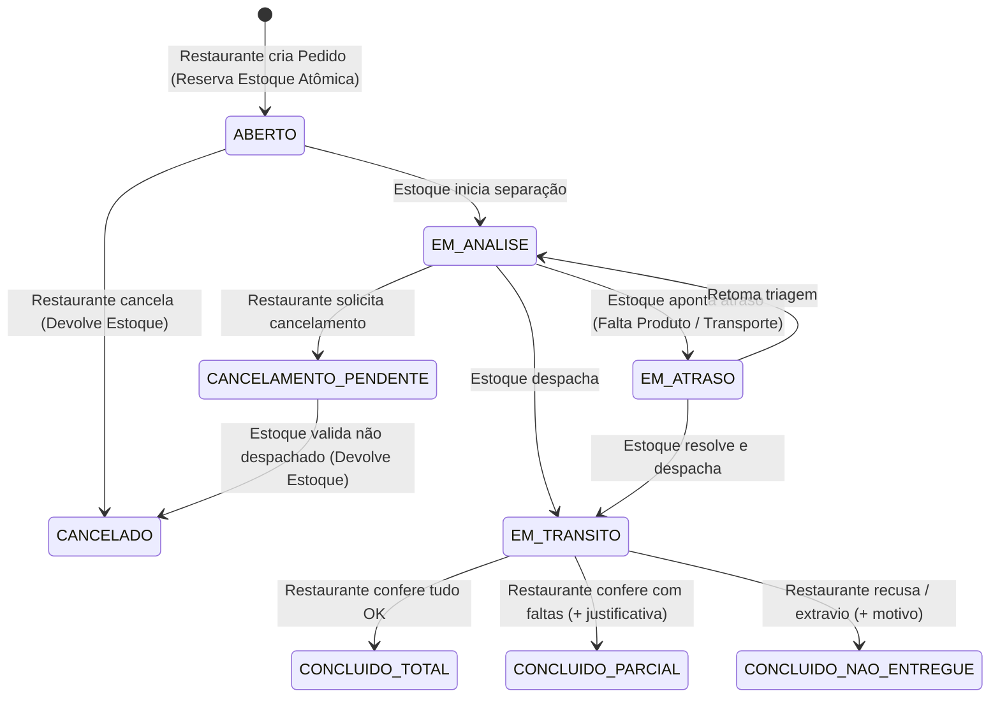

# 📦 InsumoSync — Master Blueprint & Living Documentation

> ⚠️ **DIRETRIZ DE SINCRONIZAÇÃO (LIVING SPEC):**
> Este arquivo é a **Única Fonte da Verdade (Single Source of Truth)** do projeto.
> Sempre que o usuário alterar uma regra de negócio, sugerir novas funcionalidades ou mudar o escopo, o Tech Lead (IA) **DEVE editar este arquivo imediatamente** para registrar a nova definição antes de implementar o código.

---

## 🎯 1. Visão Geral do Produto e Escopo

**InsumoSync** é um sistema web responsivo (**Mobile-First**, com layout adaptado para Desktop) para controle de suprimentos, gestão de estoque central e reposição de insumos em tempo real para redes de restaurantes.

- **Slogan:** *Sincronia em tempo real entre o estoque central e a sua cozinha.*
- **Escopo do MVP (Trabalho Acadêmico):** 1 Estoque Central (Depósito), 1 Restaurante (Filial) e 1 Painel de Administrador Geral (Analytics).
- **Arquitetura & Infraestrutura (Free-Tier Compliance):**
  - **Front-end / App:** Vercel (Next.js App Router com TypeScript).
  - **Back-end & Banco:** Supabase (PostgreSQL, Row Level Security e Supabase Realtime).
  - **Estilização & UI:** Tailwind CSS, Lucide Icons e Shadcn UI.
- **Autenticação & Acesso:**
  - Inicialmente via **Email/Usuário e Senha (Supabase Auth)** sem 2FA (Two-Factor Authentication) para garantir agilidade no MVP.
  - Convivência com o **Demo Switcher** para alternância instantânea entre as 3 personas durante testes e demonstrações acadêmicas.

### 📚 Índice de Documentação Modular (Hub & Spoke)
- [business-rules.md](file:///c:/Users/mathe/source/repos/Google%20AntiGravity/Gestao%20de%20Estoque/docs/business-rules.md) — Regras de negócio, cálculos de estoque e políticas de cancelamento.
- [database-schema.md](file:///c:/Users/mathe/source/repos/Google%20AntiGravity/Gestao%20de%20Estoque/docs/database-schema.md) — Dicionário de dados, tabelas, RPCs, índices e RLS.
- [state-machine.md](file:///c:/Users/mathe/source/repos/Google%20AntiGravity/Gestao%20de%20Estoque/docs/state-machine.md) — Máquina de estados completa, condições de guarda e eventos.
- [personas-and-ux.md](file:///c:/Users/mathe/source/repos/Google%20AntiGravity/Gestao%20de%20Estoque/docs/personas-and-ux.md) — Diretrizes de UX Mobile-First, Bottom Sheets e telas de cada persona.
- [001-atomic-rpc-concurrency.md](file:///c:/Users/mathe/source/repos/Google%20AntiGravity/Gestao%20de%20Estoque/docs/adr/001-atomic-rpc-concurrency.md) — ADR sobre a reserva atômica de saldo via `SELECT ... FOR UPDATE`.

---

## 🛡️ 2. GUARD RAILS (Travas de Segurança Inegociáveis)

O Tech Lead e todos os subagentes devem obedecer estritamente aos 4 pilares de segurança e engenharia:

### 🔒 A. Segurança e Proteção do Código (Segurança em 1º Lugar)
1. **Zero Secret & Credential Exposure (Proibição Absoluta de Chaves Hardcoded):**
   - É terminantemente proibido commitar, logar, hardcodar ou expor credenciais, API keys, URLs de projetos ou tokens de segurança diretamente no código-fonte, scripts ou fallbacks de código (ex: `process.env.KEY || 'hardcoded_key'`).
   - Toda e qualquer credencial DEVE ser consumida exclusivamente através de variáveis de ambiente (`process.env.*`).
   - Se uma variável de ambiente necessária estiver ausente, o código deve lançar erro/alerta explícito sem jamais recorrer a chaves reais embutidas como fallback.
   - O arquivo `.gitignore` deve proteger rigorosamente `.env`, `.env.local` e similares.
2. **Bloqueio de Comandos Destrutivos:** Bloqueio absoluto de comandos com risco de perda de código (`rm -rf`, `git push --force`, `git reset --hard` sem confirmação explícita).
3. **Preservação Cirúrgica:** Modificações de código devem ser precisas, preservando comentários, docstrings e estruturas funcionais existentes.

### 📐 B. Arquitetura e Boas Práticas
4. **Controle de Dependências:** Justificar e validar tecnicamente antes de instalar novos pacotes npm (priorizar soluções nativas e pacotes essenciais).
5. **Tipagem Estrita:** Proibição de tipos `any` genéricos sem validação formal (`src/types/database.ts`).
6. **Separação de Camadas:** Isolamento estrito entre apresentação (Components), regras de negócio (`workflow-engine`) e persistência (`cloud-db-architect`).
7. **Atomicidade de Concorrência:** Proibido calcular baixa de saldo no front-end JS. Todo desconto e reserva de estoque ocorre no PostgreSQL via Stored Procedure RPC com `SELECT ... FOR UPDATE`.
8. **Mobile-First Real & Custo Zero:** Telas otimizadas para 360px–420px, alvos de toque >= 44x44px, Bottom Sheets, `overflow-x: hidden` e 100% de conformidade com o Free-Tier da Vercel e Supabase.

### 🧪 C. Qualidade, Testes e Verificação
9. **Testes Obrigatórios:** Criação de testes e scripts de validação para novas features, especialmente fluxos de reserva concorrente e estorno de pedidos.
10. **Validação Pré-Finalização:** Nenhuma tarefa é encerrada sem passar com 0 erros por `npx tsc --noEmit` e `npm run build`.
11. **Inspeção de Contratos de API:** Proibido assumir contratos de APIs ou colunas sem antes inspecionar o schema do banco e as definições TypeScript.

### 💬 D. Comportamento e Comunicação do Agente
12. **Living Blueprint Sincronizado:** `antigravity.md` é a única fonte da verdade e é atualizado antes de qualquer modificação de código.
13. **Comunicação Objetiva:** Respostas diretas em português com links clicáveis para os arquivos.
14. **Planejamento Prévio:** Apresentação obrigatória do `implementation_plan.md` antes de alterações estruturais.
15. **Orquestração Mandatória por Especialidade:** O Tech Lead deve delegar as tarefas técnicas aos subagentes especializados conforme seu domínio.
16. **Disponibilidade do Modo Demo:** O `DemoSwitcher` deve permanecer funcional e acessível em todas as telas para facilitar a demonstração acadêmica.

---

## 👥 3. Personas e Especificações de Telas

### 📦 A. Estoque Central (Depósito)
- **Mini-Dashboard no Topo:** Cards rápidos com contadores atualizados em tempo real:
  - 📥 *Pedidos para Analisar* (com badge de destaque).
  - 🚚 *Pedidos em Trânsito*.
  - ⚠️ *Itens Críticos / Estoque Baixo* (saldo abaixo do ponto de reposição configurado).
- **Gestão de Insumos & Reabastecimento:**
  - Barra de busca instantânea por nome do insumo.
  - Filtros por categoria (*Hortifrúti, Carnes, Bebidas, etc.*) e filtro rápido `[⚠️ Apenas Estoque Baixo]`.
  - Modal rápido de entrada/reabastecimento manual de saldo no depósito.
- **Painel de Pedidos Recebidos & Triagem:**
  - Recebimento de novos pedidos com **Efeito Sonoro (Áudio Chime suave opcional)** e alerta visual em tempo real via Supabase Realtime.
  - Ações de triagem:
    - Mover de ABERTO para EM_ANALISE.
    - Apontar atrasos (EM_ATRASO) com justificativas obrigatórias (*Falta de Produto* ou *Transporte Indisponível*).
    - Despachar para EM_TRANSITO.
    - Validar e liberar cancelamentos solicitados pelo restaurante.

### 🍽️ B. Restaurante (Filial)
- **Catálogo de Insumos & Checklist de Pedido:**
  - Barra de busca instantânea e pílulas de filtro por categoria.
  - Exibição de saldo em tempo real (bloqueio visual para não permitir selecionar quantidade superior ao saldo disponível).
  - Carrinho touch-friendly (Bottom Sheet no mobile) com cálculo automático e validação de checkout.
- **Acompanhamento do Pedido & Linha do Tempo (Audit Log):**
  - Timeline visual estilo app de entrega com histórico completo de cada mudança de status, horários e motivos de atraso.
- **Conferência na Entrega (Check-in):**
  - Finalização do pedido na entrega marcando o desfecho:
    - `ENTREGUE_TOTAL` (Todos os itens recebidos).
    - `ENTREGUE_PARCIAL` (Recebimento com faltas + campo obrigatório de justificativa).
    - `NAO_ENTREGUE` (Recusa ou extravio + motivo).
- **Cancelamento:** Solicitação de cancelamento disponível até a fase EM_ANALISE.

### 👑 C. Administrador (Gestão & Analytics)
- **Acesso Unificado:** Visualização completa dos dados do Restaurante e do Estoque.
- **Dashboard de Analytics:**
  - Taxa de pontualidade (% de entregas no prazo vs atrasadas).
  - Gráfico com motivos mais frequentes de atraso (*Transporte* vs *Falta de Insumo*).
  - Proporção de desfechos de entrega (`Total` vs `Parcial` vs `Não Entregue`).
  - Histórico geral e curva de consumo de insumos.

### 🎭 D. Modo Demonstração (Demo Switcher)
- Seletor fixo no topo da aplicação para alternância instantânea com 1 clique:
  `[📦 Modo Estoque]` | `[🍽️ Modo Restaurante]` | `[👑 Modo Administrador]`

---

## 🔄 4. Máquina de Estados, Concorrência e Auditoria

### ⚡ Regra de Concorrência (Race Condition):
- A função PostgreSQL `place_order_with_reservation()` no Supabase utiliza `SELECT ... FOR UPDATE` nas linhas dos produtos solicitados.
- Se dois usuários submeterem um pedido simultaneamente disputando o último saldo, a primeira transação reserva o saldo; a segunda transação aborta com segurança e retorna erro amigável, disparando um ajuste visual no carrinho do segundo usuário.

### 📜 Auditoria de Mudança de Status (`order_status_logs`):
- Toda alteração de status gera automaticamente um registro na tabela de logs contendo: `order_id`, `from_status`, `to_status`, `changed_by`, `reason` e `created_at`.

---

## 📐 5. Modelo de Dados Relacional (Supabase / PostgreSQL)

- **`restaurants`**: `id (uuid PK)`, `name (text)`, `address (text)`, `is_active (boolean)`, `created_at (timestamp)`.
- **`products`**: `id (uuid PK)`, `name (text)`, `category (text)`, `unit (text)`, `current_stock (numeric)`, `min_stock_alert (numeric)`, `created_at (timestamp)`.
- **`orders`**: `id (uuid PK)`, `restaurant_id (uuid FK)`, `status (text)`, `delay_reason (text)`, `completion_type (text)`, `notes (text)`, `created_at (timestamp)`, `updated_at (timestamp)`.
- **`order_items`**: `id (uuid PK)`, `order_id (uuid FK)`, `product_id (uuid FK)`, `requested_qty (numeric)`, `approved_qty (numeric)`, `delivered_qty (numeric)`.
- **`order_status_logs`**: `id (uuid PK)`, `order_id (uuid FK)`, `from_status (text)`, `to_status (text)`, `reason (text)`, `created_at (timestamp)`.
- **`stock_movements`**: `id (uuid PK)`, `product_id (uuid FK)`, `type (text)`, `quantity (numeric)`, `reason (text)`, `created_at (timestamp)`.

---

## 🤖 6. Arquitetura de Subagentes Especializados

> 📌 **DIRETRIZ DE ORQUESTRAÇÃO & DELEGAÇÃO:**
> O **Tech Lead (IA Orquestradora)** DEVE sempre, sempre que possível, utilizar e delegar as demandas técnicas aos subagentes especializados conforme a necessidade e especialidade de cada um.
> As tarefas devem ser formalmente divididas e executadas sob a responsabilidade do subagente especialista em seu domínio, assegurando foco técnico, rastreabilidade e máxima qualidade na entrega.

O **Tech Lead (Orquestrador Principal)** coordena e divide as demandas entre os seguintes subagentes especializados:

1. 🏛️ **`cloud-db-architect` (Supabase, SQL, RLS, Realtime & Cloud)**:
   - Modelagem relacional PostgreSQL no Supabase, scripts DDL e migrations.
   - Políticas de Row Level Security (RLS) e infraestrutura Vercel / Supabase Free-tier.
   - Stored Procedures RPC com transações atômicas (`SELECT ... FOR UPDATE`) para concorrência de estoque.
   - Configuração de canais Supabase Realtime para sincronização instantânea.

2. ⚙️ **`backend-workflow-engine` (Back-end, Máquina de Estados & Regras de Negócio)**:
   - Implementação da máquina de estados finita dos pedidos (`ABERTO` ➔ `EM_ANALISE` ➔ `EM_TRANSITO` / `EM_ATRASO` ➔ `CONCLUIDO_*` / `CANCELADO`).
   - Validação de regras de negócio, Server Actions, Route Handlers e validações com Zod.
   - Gestão de estorno de estoque em cancelamentos e orquestração de logs de auditoria.

3. 📱 **`frontend-engineer` (Front-end Next.js, App Router & Integração)**:
   - Estruturação do Next.js (App Router, TypeScript, React Server/Client Components).
   - Gerenciamento de estado local/global (React Hooks, Context API) e consumo de APIs/RPCs.
   - Subscrições ativas do Supabase Realtime no cliente para atualização reativa das telas.

4. 🎨 **`ui-ux-designer` (Mobile-First UI, Design System & Micro-interações)**:
   - Estilização com Tailwind CSS, Shadcn UI / Radix primitives e Lucide Icons.
   - Construção de interfaces Mobile-First reais (360px-420px, touch targets >= 44x44px, `overflow-x: hidden`).
   - Componentes touch-friendly: Bottom Sheets (gavetas para carrinho/filtros), pílulas de filtro e timelines visuais.
   - Síntese de áudio chime suave via Web Audio API para notificações sonoras.

5. 📊 **`analytics-specialist` (KPIs, Dashboards & Relatórios)**:
   - Mini-dashboard de contadores e estoque crítico do Depósito Central.
   - Dashboard completo do Administrador com métricas de pontualidade, curvas de consumo e gráficos de motivos de atraso / desfechos de entrega.

6. 📜 **`doc-specialist` (Living Blueprint, Governança & Documentação Técnica Hub-and-Spoke)**:
   - **Guardião da Documentação Viva:** Responsável direto por manter o `antigravity.md` (Hub Central) e todos os módulos em `docs/` rigorosamente atualizados.
   - **Registro de Decisões (ADRs):** Documenta todas as decisões arquiteturais e técnicas em `docs/adr/`.
   - **Sincronização Pós-Tarefa Mandatória:** Sempre que qualquer subagente finalizar uma tarefa ou alterar uma regra, o `doc-specialist` é acionado para revisar, validar e registrar a alteração nas documentações correspondentes.
   - **Manutenção dos Módulos Especializados (`docs/`):**
     - `docs/business-rules.md`: Regras de negócio aprofundadas, prazos e cálculos.
     - `docs/database-schema.md`: Dicionário de dados, RPCs, RLS e índices.
     - `docs/state-machine.md`: Máquina de estados detalhada e condições de transição.
     - `docs/personas-and-ux.md`: Especificações de telas e fluxos de cada persona.

7. 🧪 **`qa-devops-agent` (Versionamento, CI/CD, Demo Switcher, Seed & Testes de Concorrência)**:
   - Implementação e manutenção do componente global `DemoSwitcher`.
   - Criação e execução de scripts de seed com dados realistas de restaurantes e insumos.
   - Testes de concorrência simultânea (race conditions) nas RPCs do Supabase.
   - Configuração de versionamento Git, validações de build (`npm run build`, linting) e checklist de CI/CD para deploy na Vercel.

---

## 🗺️ 7. Roadmap de Implementação Fase a Fase

- [x] **Fase 0: Setup da Base, Design System & Demo Switcher**
  - Configuração do Next.js (App Router), TypeScript, Tailwind CSS, Lucide Icons, Shadcn UI, cliente Supabase, utilitário de áudio chime, barra global DemoSwitcher e estrutura de docs Hub & Spoke.
  - *Agentes:* Tech Lead + `frontend-engineer` + `ui-ux-designer` + `qa-devops-agent` + `doc-specialist`.

- [x] **Fase 1: Banco de Dados, RPC Atômica & Supabase Realtime (Definições & Migrations)**
  - Criação das migrations SQL, políticas RLS, triggers de auditoria, Stored Procedures `place_order_with_reservation()`, `transition_order_status()`, `restock_product()`, script consolidado `complete_setup.sql` e dados de seed.
  - *Agentes:* `cloud-db-architect` + `qa-devops-agent` + `doc-specialist`.

- [ ] **Fase 2: Motor de Estados & Lógica de Negócio**
  - Implementação das funções de transição de status, controle de atrasos com motivos obrigatórios, cancelamentos e devolução atômica de estoque.
  - *Agentes:* `backend-workflow-engine` + `cloud-db-architect`.

- [ ] **Fase 3: Módulo do Restaurante (Mobile-First)**
  - Catálogo de insumos com busca e filtros, checklist de pedido com bloqueio de saldo, carrinho em Bottom Sheet, tela de timeline e conferência na entrega (`Total`, `Parcial`, `Não Entregue`).
  - *Agentes:* `ui-ux-designer` + `frontend-engineer` + `backend-workflow-engine`.

- [ ] **Fase 4: Módulo do Estoque Central**
  - Mini-dashboard de métricas no topo, efeito sonoro (áudio chime), busca e filtros de insumos (incluindo filtro de estoque baixo), modal de reabastecimento manual e painel de triagem/separação de pedidos.
  - *Agentes:* `ui-ux-designer` + `frontend-engineer` + `backend-workflow-engine`.

- [ ] **Fase 5: Módulo do Administrador (Analytics)**
  - Painel com visão unificada, cards de KPIs gerais, gráficos de motivos de atraso e indicadores de desfechos de entrega.
  - *Agentes:* `analytics-specialist` + `ui-ux-designer` + `frontend-engineer`.

- [ ] **Fase 6: Testes de QA, Concorrência, Versionamento & Deploy na Vercel**
  - Testes de concorrência simultânea, validação em viewports mobile, esteira de verificação/build e checklist de deploy na Vercel.
  - *Agentes:* `qa-devops-agent` + `doc-specialist` + Tech Lead.

---

## 🔮 8. Backlog & Roadmap Futuro (Pós-MVP)
- [ ] **IA LLM para Análise e Insights:** Integração com Gemini API para gerar relatórios preditivos de consumo, previsão de reposição e detecção de gargalos para o Administrador.
- [ ] **Notificações Externas:** Disparo automático de alertas via WhatsApp e E-mail.
- [ ] **Gestão de Sobras Parciais:** Reprocessamento automático ou crédito de itens faltantes.
- [ ] **Conversões Avançadas de Unidades:** Fracionamento e conversão de caixas/fardos para quilos/unidades.
- [ ] **Multi-Restaurantes Dinâmico:** CRUD de novos restaurantes e filiais.