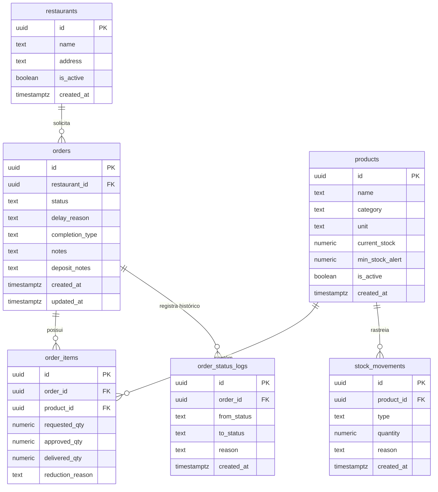

# 🗄️ Dicionário de Dados & Schema do Supabase — InsumoSync

Este documento contém a especificação técnica completa de tabelas, tipos de dados, chaves primárias, relacionamentos, políticas de RLS e Stored Procedures (RPCs) no PostgreSQL / Supabase.

---

## 1. Diagrama Entidade-Relacionamento (ERD)

---

## 2. Tabelas e Estrutura

### 2.1 `restaurants`
| Coluna | Tipo | Restrições | Descrição |
| :--- | :--- | :--- | :--- |
| `id` | `UUID` | `PRIMARY KEY DEFAULT gen_random_uuid()` | Identificador único do restaurante |
| `name` | `TEXT` | `NOT NULL` | Nome fantasia da unidade |
| `address` | `TEXT` | `NULL` | Endereço físico do restaurante |
| `is_active` | `BOOLEAN` | `DEFAULT true` | Status de ativação da filial |
| `created_at` | `TIMESTAMPTZ` | `DEFAULT now()` | Data de criação |

### 2.2 `products`
| Coluna | Tipo | Restrições | Descrição |
| :--- | :--- | :--- | :--- |
| `id` | `UUID` | `PRIMARY KEY DEFAULT gen_random_uuid()` | Identificador único do insumo |
| `name` | `TEXT` | `NOT NULL` | Nome do insumo (ex: *Filé Mignon*, *Tomate Italiano*) |
| `category` | `TEXT` | `NOT NULL` | Categoria (*Carnes & Aves*, *Hortifrúti*, *Laticínios*, etc.) |
| `unit` | `TEXT` | `NOT NULL` | Unidade de medida (`KG`, `UN`, `L`, `CX`, `PCT`) |
| `current_stock` | `NUMERIC` | `NOT NULL DEFAULT 0 CHECK (current_stock >= 0)` | Saldo atual no depósito central |
| `min_stock_alert`| `NUMERIC` | `NOT NULL DEFAULT 5` | Ponto de pedido para alerta de estoque crítico |
| `is_active` | `BOOLEAN` | `NOT NULL DEFAULT true` | Insumo visível no catálogo. `false` é o soft-delete: some do catálogo do restaurante e preserva todo o histórico |
| `created_at` | `TIMESTAMPTZ` | `DEFAULT now()` | Data de cadastro |

> Índice `idx_products_is_active` em `is_active`, usado pelo filtro padrão do catálogo.

### 2.3 `orders`
| Coluna | Tipo | Restrições | Descrição |
| :--- | :--- | :--- | :--- |
| `id` | `UUID` | `PRIMARY KEY DEFAULT gen_random_uuid()` | Identificador único do pedido |
| `restaurant_id`| `UUID` | `REFERENCES restaurants(id) ON DELETE CASCADE` | Filial solicitante |
| `status` | `TEXT` | `NOT NULL DEFAULT 'ABERTO'` | Status atual na máquina de estados |
| `delay_reason` | `TEXT` | `NULL` | Motivo de atraso (*Falta de Produto* / *Transporte*) |
| `completion_type` | `TEXT` | `NULL` | Desfecho da entrega (`TOTAL`, `PARCIAL`, `NAO_ENTREGUE`) |
| `notes` | `TEXT` | `NULL` | Observações gerais do pedido, escritas pelo restaurante |
| `deposit_notes` | `TEXT` | `NULL` | Recados do depósito ao motorista e ao restaurante, preenchidos na triagem |
| `created_at` | `TIMESTAMPTZ` | `DEFAULT now()` | Data e hora de criação |
| `updated_at` | `TIMESTAMPTZ` | `DEFAULT now()` | Data e hora da última alteração |

### 2.4 `order_items`
| Coluna | Tipo | Restrições | Descrição |
| :--- | :--- | :--- | :--- |
| `id` | `UUID` | `PRIMARY KEY DEFAULT gen_random_uuid()` | Identificador único do item |
| `order_id` | `UUID` | `REFERENCES orders(id) ON DELETE CASCADE` | Pedido associado |
| `product_id` | `UUID` | `REFERENCES products(id) ON DELETE RESTRICT` | Insumo requisitado |
| `requested_qty`| `NUMERIC` | `NOT NULL CHECK (requested_qty > 0)` | Quantidade solicitada pelo restaurante |
| `approved_qty` | `NUMERIC` | `NULL` | Quantidade aprovada pelo depósito. **É o saldo efetivamente retido do estoque** enquanto o pedido não é terminal |
| `delivered_qty`| `NUMERIC` | `NULL` | Quantidade recebida na entrega |
| `reduction_reason` | `TEXT` | `NULL` | Justificativa individual obrigatória quando `approved_qty < requested_qty` |

> O `ON DELETE RESTRICT` em `product_id` é o que torna a remoção definitiva de um
> insumo impossível assim que ele participa de qualquer pedido — a garantia física
> de integridade do histórico.

### 2.5 `order_status_logs`
| Coluna | Tipo | Restrições | Descrição |
| :--- | :--- | :--- | :--- |
| `id` | `UUID` | `PRIMARY KEY DEFAULT gen_random_uuid()` | Identificador do log |
| `order_id` | `UUID` | `REFERENCES orders(id) ON DELETE CASCADE` | Pedido monitorado |
| `from_status` | `TEXT` | `NULL` | Status anterior |
| `to_status` | `TEXT` | `NOT NULL` | Novo status assumido |
| `reason` | `TEXT` | `NULL` | Justificativa ou observação da mudança |
| `created_at` | `TIMESTAMPTZ` | `DEFAULT now()` | Timestamp exato da transição |

### 2.6 `stock_movements`
| Coluna | Tipo | Restrições | Descrição |
| :--- | :--- | :--- | :--- |
| `id` | `UUID` | `PRIMARY KEY DEFAULT gen_random_uuid()` | Identificador da movimentação |
| `product_id` | `UUID` | `REFERENCES products(id) ON DELETE CASCADE` | Insumo movimentado |
| `type` | `TEXT` | `NOT NULL` | `ENTRADA_MANUAL`, `SAIDA_PEDIDO`, `ESTORNO_CANCELAMENTO` |
| `quantity` | `NUMERIC` | `NOT NULL` | Quantidade movimentada (positiva ou negativa) |
| `reason` | `TEXT` | `NULL` | Motivo ou número do pedido |
| `created_at` | `TIMESTAMPTZ` | `DEFAULT now()` | Data e hora do movimento |

---

## 3. Stored Procedures (RPCs)

1. **`place_order_with_reservation(p_restaurant_id uuid, p_items jsonb, p_notes text)`**:
   - Trava as linhas em `products` com `SELECT ... FOR UPDATE`.
   - Verifica estoque de todos os itens atomicamente.
   - Deduz `current_stock`, cria `orders`, `order_items`, `order_status_logs` e `stock_movements`.
   - Retorna JSON `{ success: boolean, order_id?: uuid, error?: string, code?: string }`.

2. **`transition_order_status(p_order_id uuid, p_new_status text, p_reason text, p_completion_type text)`**:
   - Valida a transição de status permitida na máquina de estados.
   - Atualiza `orders.status`, `delay_reason`, `completion_type` e `updated_at`.
   - Se `p_new_status = 'CANCELADO'`, devolve atomicamente ao estoque o saldo retido —
     `COALESCE(approved_qty, requested_qty)`, **nunca `requested_qty` puro** — e grava `stock_movements`.
   - Grava registro de auditoria em `order_status_logs`.
   - Códigos de erro: `ORDER_NOT_FOUND`, `TERMINAL_STATE`.

3. **`restock_product(p_product_id uuid, p_quantity numeric, p_reason text)`**:
   - Incrementa `current_stock` em `products` e insere `stock_movements` com `ENTRADA_MANUAL`.

4. **`apply_order_triage(p_order_id uuid, p_items jsonb, p_deposit_notes text)`**:
   - Aplica a triagem do depósito em uma única transação. Substituiu o `UPDATE` direto
     que o cliente fazia em `order_items` — a triagem agora respeita o Guard Rail #7.
   - `p_items` é um array de `{ item_id, approved_qty, reduction_reason }`.
   - Trava o pedido e todos os insumos envolvidos com `SELECT ... FOR UPDATE`, em ordem
     determinística de `product_id` para evitar deadlock entre operadores simultâneos.
   - **Valida tudo antes de escrever qualquer coisa** (duas passadas), de modo que uma
     rejeição nunca deixa o pedido parcialmente triado.
   - Devolve ao `current_stock` a diferença reduzida e grava a movimentação correspondente;
     ampliar a quantidade volta a debitar o saldo, exigindo disponibilidade.
   - Exige `reduction_reason` sempre que `approved_qty < requested_qty`.
   - Persiste `deposit_notes` (`NULL` preserva o valor atual, string vazia limpa o campo) e
     registra a triagem em `order_status_logs`.
   - Códigos de erro: `ORDER_NOT_FOUND`, `TERMINAL_STATE`, `ITEM_NOT_FOUND`,
     `INVALID_QUANTITY`, `REASON_REQUIRED`, `INSUFFICIENT_STOCK`.
   - Retorna `{ success, order_id, returned_to_stock }`, onde `returned_to_stock` é positivo
     quando houve devolução ao estoque e negativo quando houve reserva adicional.

5. **`create_or_update_product(p_id uuid, p_name text, p_category text, p_unit text, p_current_stock numeric, p_min_stock_alert numeric)`**:
   - `p_id` nulo cria o insumo (gerando `ENTRADA_MANUAL` quando há saldo inicial);
     `p_id` preenchido atualiza os dados cadastrais.
   - A edição **não** altera `current_stock` — saldo só muda por `restock_product` ou por
     movimentação de pedido.

6. **`check_product_usage(p_product_id uuid)`**:
   - Fonte de verdade server-side para a interface decidir entre desativar e remover.
   - Retorna `{ open_order_count, total_item_count, can_hard_delete }`.

7. **`deactivate_product(p_product_id uuid, p_force boolean)`**:
   - Soft-delete: marca `is_active = false`, preservando todo o histórico.
   - Sem `p_force`, retorna `CONFLICT_ORDERS` quando o insumo está em pedidos
     `ABERTO`/`EM_ANALISE` — e nenhuma escrita acontece.
   - Com `p_force`, para cada pedido afetado: estorna ao estoque o saldo retido, zera
     `approved_qty` e grava em `reduction_reason` o motivo da inativação. Pedido que fica
     sem nenhum item é cancelado automaticamente via `transition_order_status`.
   - Retorna `{ affected_orders, returned_to_stock, cancelled_orders }`.

8. **`reactivate_product(p_product_id uuid)`**:
   - Devolve o insumo ao catálogo (`is_active = true`).

9. **`delete_product(p_product_id uuid)`**:
   - Remoção definitiva, permitida **somente** para insumo sem nenhum `order_items`.
   - Com histórico, retorna `HAS_ORDER_HISTORY` com a contagem de itens, e a interface
     oferece a desativação como alternativa.
   - As `stock_movements` do insumo caem por `CASCADE` junto com a linha.

10. **`get_admin_analytics()`**:
    - Agregações consolidadas do painel do Administrador (docs/business-rules.md seção 6).
    - Somente leitura. Retorna `{ success, kpis, delay_reasons, outcomes, consumption, orders_timeline }`.

11. **`get_stock_forecasting(p_days_window int DEFAULT 14)`**:
    - Previsibilidade de estoque central e recomendações de compra baseadas no ritmo de saídas globais (docs/business-rules.md seção 7).
    - Somente leitura. Analisa `stock_movements` e `order_items` para calcular o consumo diário médio, dias até o esgotamento, data projetada de término, urgência e lote de compra recomendado.
    - Retorna `{ success, window_days, summary, items }`.

12. **`get_restaurant_recommendations(p_restaurant_id uuid, p_days_window int DEFAULT 30)`**:
    - Recomendações de reposição para a cozinha do restaurante (docs/business-rules.md seção 8).
    - Somente leitura. Analisa o histórico de pedidos daquela unidade específica, o tempo decorrido desde o último abastecimento e o estoque disponível no depósito central.
    - Retorna `{ success, restaurant_id, window_days, summary, items }` onde cada item inclui `product_id`, `name`, `category`, `unit`, `urgency` (`URGENTE`, `RECOMENDADO`, `ROTINA`), `recommended_order_qty`, `reason`, `days_since_last_order`, `available_stock`.

