# 🗄️ Dicionário de Dados & Schema do Supabase — InsumoSync

Este documento contém a especificação técnica completa de tabelas, tipos de dados, chaves primárias, relacionamentos, políticas de RLS e Stored Procedures (RPCs) no PostgreSQL / Supabase.

---

## 1. Diagrama Entidade-Relacionamento (ERD)

```mermaid
erDiagram
    restaurants ||--o{ orders : "solicita"
    products ||--o{ order_items : "contém"
    orders ||--o{ order_items : "possui"
    orders ||--o{ order_status_logs : "registra histórico"
    products ||--o{ stock_movements : "rastreia"

    restaurants {
        uuid id PK
        text name
        text address
        boolean is_active
        timestamptz created_at
    }

    products {
        uuid id PK
        text name
        text category
        text unit
        numeric current_stock
        numeric min_stock_alert
        timestamptz created_at
    }

    orders {
        uuid id PK
        uuid restaurant_id FK
        text status
        text delay_reason
        text completion_type
        text notes
        timestamptz created_at
        timestamptz updated_at
    }

    order_items {
        uuid id PK
        uuid order_id FK
        uuid product_id FK
        numeric requested_qty
        numeric approved_qty
        numeric delivered_qty
    }

    order_status_logs {
        uuid id PK
        uuid order_id FK
        text from_status
        text to_status
        text reason
        timestamptz created_at
    }

    stock_movements {
        uuid id PK
        uuid product_id FK
        text type
        numeric quantity
        text reason
        timestamptz created_at
    }
```

---

## 2. Tabelas e Estrutura

### 2.1 `restaurants`
| Coluna | Tipo | Restrições | Descrição |
| :--- | :--- | :--- | :--- |
| `id` | `UUID` | `PRIMARY KEY DEFAULT gen_random_uuid()` | Identificador único do restaurante |
| `name` | `TEXT` | `NOT NULL` | Nome fantasia da unidade |
| `address` | `TEXT` | `NULL` | Endereço físico do restaurante |
| `is_active` | `BOOLEAN` | `DEFAULT true` | Status de ativação da filial |
| `created_at` | `TIMESTAMPTZ` | `DEFAULT now()` | Data de criação |

### 2.2 `products`
| Coluna | Tipo | Restrições | Descrição |
| :--- | :--- | :--- | :--- |
| `id` | `UUID` | `PRIMARY KEY DEFAULT gen_random_uuid()` | Identificador único do insumo |
| `name` | `TEXT` | `NOT NULL` | Nome do insumo (ex: *Filé Mignon*, *Tomate Italiano*) |
| `category` | `TEXT` | `NOT NULL` | Categoria (*Carnes & Aves*, *Hortifrúti*, *Laticínios*, etc.) |
| `unit` | `TEXT` | `NOT NULL` | Unidade de medida (`KG`, `UN`, `L`, `CX`, `PCT`) |
| `current_stock` | `NUMERIC` | `NOT NULL DEFAULT 0 CHECK (current_stock >= 0)` | Saldo atual no depósito central |
| `min_stock_alert`| `NUMERIC` | `NOT NULL DEFAULT 5` | Ponto de pedido para alerta de estoque crítico |
| `created_at` | `TIMESTAMPTZ` | `DEFAULT now()` | Data de cadastro |

### 2.3 `orders`
| Coluna | Tipo | Restrições | Descrição |
| :--- | :--- | :--- | :--- |
| `id` | `UUID` | `PRIMARY KEY DEFAULT gen_random_uuid()` | Identificador único do pedido |
| `restaurant_id`| `UUID` | `REFERENCES restaurants(id) ON DELETE CASCADE` | Filial solicitante |
| `status` | `TEXT` | `NOT NULL DEFAULT 'ABERTO'` | Status atual na máquina de estados |
| `delay_reason` | `TEXT` | `NULL` | Motivo de atraso (*Falta de Produto* / *Transporte*) |
| `completion_type` | `TEXT` | `NULL` | Desfecho da entrega (`TOTAL`, `PARCIAL`, `NAO_ENTREGUE`) |
| `notes` | `TEXT` | `NULL` | Observações gerais do pedido |
| `created_at` | `TIMESTAMPTZ` | `DEFAULT now()` | Data e hora de criação |
| `updated_at` | `TIMESTAMPTZ` | `DEFAULT now()` | Data e hora da última alteração |

### 2.4 `order_items`
| Coluna | Tipo | Restrições | Descrição |
| :--- | :--- | :--- | :--- |
| `id` | `UUID` | `PRIMARY KEY DEFAULT gen_random_uuid()` | Identificador único do item |
| `order_id` | `UUID` | `REFERENCES orders(id) ON DELETE CASCADE` | Pedido associado |
| `product_id` | `UUID` | `REFERENCES products(id) ON DELETE RESTRICT` | Insumo requisitado |
| `requested_qty`| `NUMERIC` | `NOT NULL CHECK (requested_qty > 0)` | Quantidade solicitada pelo restaurante |
| `approved_qty` | `NUMERIC` | `NULL` | Quantidade aprovada pelo depósito |
| `delivered_qty`| `NUMERIC` | `NULL` | Quantidade recebida na entrega |

### 2.5 `order_status_logs`
| Coluna | Tipo | Restrições | Descrição |
| :--- | :--- | :--- | :--- |
| `id` | `UUID` | `PRIMARY KEY DEFAULT gen_random_uuid()` | Identificador do log |
| `order_id` | `UUID` | `REFERENCES orders(id) ON DELETE CASCADE` | Pedido monitorado |
| `from_status` | `TEXT` | `NULL` | Status anterior |
| `to_status` | `TEXT` | `NOT NULL` | Novo status assumido |
| `reason` | `TEXT` | `NULL` | Justificativa ou observação da mudança |
| `created_at` | `TIMESTAMPTZ` | `DEFAULT now()` | Timestamp exato da transição |

### 2.6 `stock_movements`
| Coluna | Tipo | Restrições | Descrição |
| :--- | :--- | :--- | :--- |
| `id` | `UUID` | `PRIMARY KEY DEFAULT gen_random_uuid()` | Identificador da movimentação |
| `product_id` | `UUID` | `REFERENCES products(id) ON DELETE CASCADE` | Insumo movimentado |
| `type` | `TEXT` | `NOT NULL` | `ENTRADA_MANUAL`, `SAIDA_PEDIDO`, `ESTORNO_CANCELAMENTO` |
| `quantity` | `NUMERIC` | `NOT NULL` | Quantidade movimentada (positiva ou negativa) |
| `reason` | `TEXT` | `NULL` | Motivo ou número do pedido |
| `created_at` | `TIMESTAMPTZ` | `DEFAULT now()` | Data e hora do movimento |

---

## 3. Stored Procedures (RPCs)

1. **`place_order_with_reservation(p_restaurant_id uuid, p_items jsonb, p_notes text)`**:
   - Trava as linhas em `products` com `SELECT ... FOR UPDATE`.
   - Verifica estoque de todos os itens atomicamente.
   - Deduz `current_stock`, cria `orders`, `order_items`, `order_status_logs` e `stock_movements`.
   - Retorna JSON `{ success: boolean, order_id?: uuid, error?: string, code?: string }`.

2. **`transition_order_status(p_order_id uuid, p_new_status text, p_reason text, p_completion_type text)`**:
   - Valida a transição de status permitida na máquina de estados.
   - Atualiza `orders.status`, `delay_reason`, `completion_type` e `updated_at`.
   - Se `p_new_status = 'CANCELADO'`, devolve atomicamente o estoque reservado e grava `stock_movements`.
   - Grava registro de auditoria em `order_status_logs`.

3. **`restock_product(p_product_id uuid, p_quantity numeric, p_reason text)`**:
   - Incrementa `current_stock` em `products` e insere `stock_movements` com `ENTRADA_MANUAL`.
