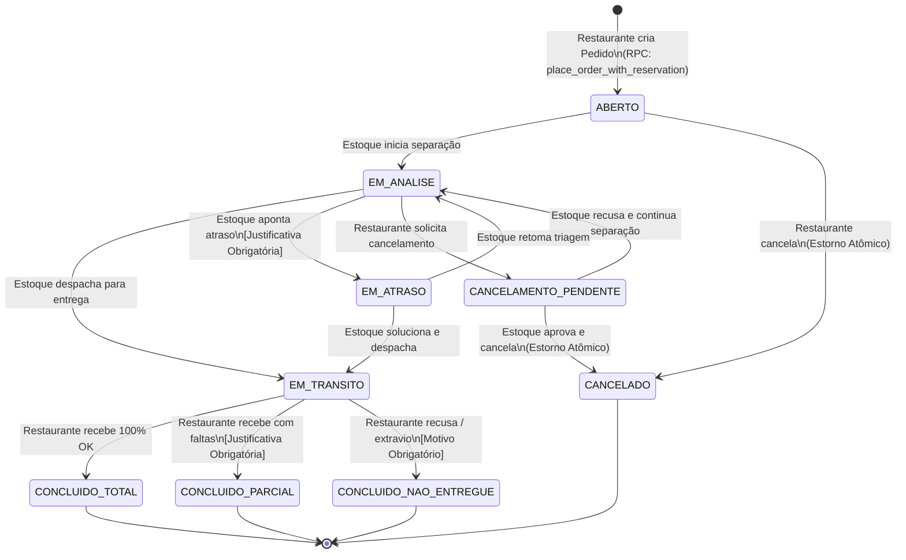

# 🔄 Máquina de Estados dos Pedidos — InsumoSync

Este documento formaliza todos os estados, eventos, condições de guarda e regras de transição do ciclo de vida de um pedido no **InsumoSync**.

---

## 1. Diagrama de Transição de Estados

---

## 2. Tabela de Estados e Permissões

| Estado | Significado | Ações Permitidas | Quem pode Alterar |
| :--- | :--- | :--- | :--- |
| `ABERTO` | Pedido gerado e estoque reservado no depósito. | Mover para `EM_ANALISE` ou `CANCELADO`. | Estoque ou Restaurante (cancelar). |
| `EM_ANALISE` | Operador do depósito está separando os itens. | Mover para `EM_TRANSITO`, `EM_ATRASO`, `CANCELAMENTO_PENDENTE` ou `CANCELADO`. | Estoque (despachar, atrasar ou cancelar) ou Restaurante (pedir cancelamento). |
| `EM_ATRASO` | Pedido sofreu impedimento logístico ou de saldo. | Retornar para `EM_ANALISE`, mover para `EM_TRANSITO` ou `CANCELADO`. | Estoque. |
| `CANCELAMENTO_PENDENTE` | Restaurante solicitou cancelamento após início da triagem. | Mover para `CANCELADO` (aprovar) ou voltar para `EM_ANALISE` (recusar). | Estoque. |
| `EM_TRANSITO` | Pedido a caminho do restaurante. | Mover para `CONCLUIDO_TOTAL`, `CONCLUIDO_PARCIAL` ou `CONCLUIDO_NAO_ENTREGUE`. | Restaurante (no ato da conferência). |
| `CONCLUIDO_TOTAL` | Entrega realizada com sucesso integral. | Estado Final (Leitura). | Ninguém (imutável). |
| `CONCLUIDO_PARCIAL` | Entrega realizada com divergências justificadas. | Estado Final (Leitura). | Ninguém (imutável). |
| `CONCLUIDO_NAO_ENTREGUE` | Pedido recusado ou extraviado. | Estado Final (Leitura). | Ninguém (imutável). |
| `CANCELADO` | Pedido abortado e estoque devolvido ao depósito. | Estado Final (Leitura). | Ninguém (imutável). |

---

## 3. Condições de Guarda & Auditoria

1. **Campos Obrigatórios em Transições Críticas:**
   - Para `EM_ATRASO`: o campo `delay_reason` é obrigatório e recebe um dos motivos da lista fixa do `OrderApprovalModal` (ver `business-rules.md` seção 3.2) ou o texto livre digitado em *Outro*.
   - Para `CONCLUIDO_PARCIAL` e `CONCLUIDO_NAO_ENTREGUE`: O campo `notes` ou `delay_reason` deve conter a justificativa do restaurante.
   - Para `CANCELADO` pelo depósito: justificativa obrigatória, escolhida entre motivos fixos ou `Outro (descrever)` com campo livre.
   - Para redução de item na triagem (`approved_qty < requested_qty`): `reduction_reason` individual obrigatória, **validada no banco** pela RPC `apply_order_triage` (`REASON_REQUIRED`).
2. **Registro Automático de Auditoria:**
   - Toda mudança gera uma linha em `order_status_logs` com `(order_id, from_status, to_status, reason, created_at)`.
   - A triagem também é registrada, com `from_status = to_status`, descrevendo o saldo devolvido ou reservado. Não é uma mudança de estado, e sim um evento de auditoria visível na linha do tempo do restaurante.

3. **Transições Automáticas do Sistema:**
   - Ao inativar um insumo no catálogo com força, todo pedido `ABERTO`/`EM_ANALISE` que ficar sem nenhum item vai automaticamente para `CANCELADO`, com o motivo registrado. É a única transição que o sistema dispara sem ação direta de uma persona.
